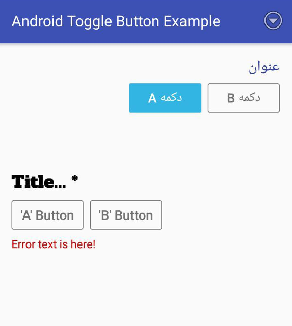

# **Android Toggle Button**

A customizable Android library to display Toggle Button.

Customizable parameters:
   - Optional/Mandatory
   - ltr/rtl or inherit layout direction


## **Version**
1.0.0
### **Requirements**

- MIN-SDK Version = 15

### **Install**
    allprojects {
        repositories {
            ...
            maven { url 'https://jitpack.io' }
        }
    }

    dependencies {
            compile 'com.github.Mojtaba-Shafaei:AndroidToggleButton:lastVersion'
    }


[](https://jitpack.io/#Mojtaba-Shafaei/AndroidToggleButton)

### **Screenshots**



### **Sample code**

```xml
<com.mojtaba_shafaei.android.ToggleButton
    android:layout_width="wrap_content"
    android:layout_height="wrap_content"
    android:layout_marginTop="40dp"
    app:tb_A_text="'A' Button"
    app:tb_B_text="'B' Button"
    app:tb_isMandatory="true"
    app:tb_layoutDirection="ltr"
    app:tb_title="Title..."
    app:tb_titleTextSize="@dimen/titleTextSize" />
```

```java
    toggleButton.setTitleTypeface(typeface);
    toggleButton.setErrorEnabled(true);
    toggleButton.setError(R.string.errorText);

```

## **Developer**

* **Mojtaba Shafaei** [Email](mjtb.shafaei@gmail.com)

## **License**
This project is licensed under the MIT License
